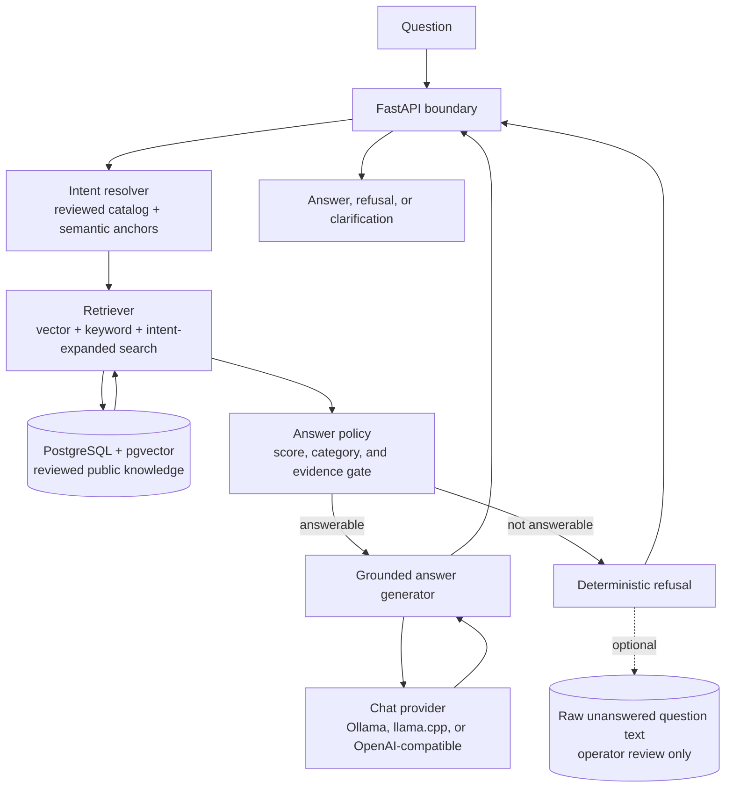

# Portfolio RAG Assistant

A small verified-context RAG backend for answering questions about a reviewed
public profile.

The project is intentionally narrow. It does not try to be a general assistant,
an autonomous agent, or a model-owned knowledge system. It keeps the domain small
enough that correctness can be inspected: every answer must come from reviewed
knowledge, every refusal must be explainable by deterministic policy, and the
language model is used only after the application has already decided that the
question is answerable.

That shape matters for modest, CPU-oriented deployments. A small local model is
much more reliable when it is not asked to classify intent, choose truth, decide
whether evidence is sufficient, invent citations, and phrase the answer at the
same time. This repository moves those responsibilities into explicit
application layers: reviewed data, bounded intent routing, hybrid retrieval,
deterministic answerability, and grounded generation.

## How It Works



The flow is deliberately conservative.

Retrieval gathers candidate evidence from the reviewed knowledge base. It uses
embeddings, PostgreSQL full-text search, and bounded intent expansion, but it
does not decide that a question may be answered.

The answer policy receives the same intent resolution and the retrieved context.
It checks whether the context is strong enough, belongs to the right reviewed
knowledge category, and contains the evidence terms required by the matched
intent. Candidate semantic intents may help retrieval, but only required intents
can affect answerability.

The answer generator receives only approved context. It asks the configured chat
provider to phrase that context, then attaches deterministic source references.
If the policy refused the question or asked for clarification, the generator does
not call the model.

## What Is In The Repository

- `src/portfolio_rag_assistant`: the application authorities, kept separate by
  responsibility: providers, knowledge ingestion, retrieval, intent routing,
  policy, generation, API orchestration, and question review.
- `config/intent-profiles.json`: reviewed runtime configuration for bounded
  intent matching and semantic routing.
- `knowledge/profile.json`: the reviewed public knowledge file currently loaded
  into PostgreSQL.
- `docs`: architecture contracts, design notes, runtime operations, API
  behavior, knowledge format, retrieval, policy, generation, and deployment
  documentation.
- `scripts/runtime`: the supported Docker Compose operation layer for local and
  server runtimes.
- `tests`: contract, policy, retrieval, runtime, privacy, calibration, and
  knowledge validation coverage.

`PLAN.md` remains the project planning history. The shorter narrative for why
the architecture is shaped this way lives in
[docs/design-decisions.md](docs/design-decisions.md), while
[docs/architecture.md](docs/architecture.md) is the authoritative architecture
contract.

## Local Shape

The default runtime uses FastAPI, PostgreSQL with `pgvector`, and explicit model
provider configuration. Chat and embedding providers are configured separately,
so the same code can use Ollama, llama.cpp, or an OpenAI-compatible endpoint.

Start from the environment template:

```sh
cp .env.example .env
```

Then fill the explicit database and provider values. The full setup path is in
[docs/server-setup.md](docs/server-setup.md). The runtime scripts validate,
migrate, ingest reviewed knowledge, index embeddings, start services, and run
smoke checks without hiding state changes behind implicit defaults.

Common local validation:

```sh
python3 -m ruff check .
timeout 45s python3 -m pytest -q tests
```

## Deliberate Limits

The assistant refuses unsupported questions. That is not a failure mode; it is
part of the design.

The system does not:

- learn facts automatically from visitor questions;
- store visitor identity or request metadata;
- expose retrieval scores, prompts, stack traces, or internal source URIs;
- treat the LLM as the source of truth;
- run an autonomous tool loop;
- answer private, speculative, off-topic, or unsupported questions.

Unanswered questions can be collected as raw text only when the operator enables
that feature. They are review signals, never automatic knowledge.
